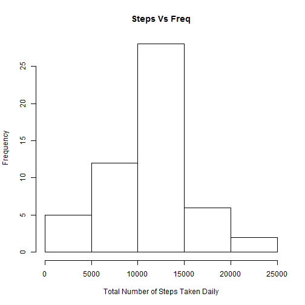
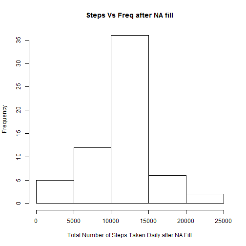
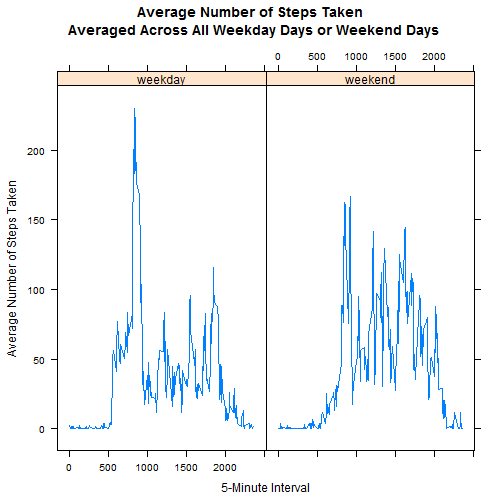

##Introduction

The goal of this assignment to practice skills needed for reproducible research. Specifically this assignment use R markdown to write a report that answers the questions detailed in the sections below. In the process, the single R markdown document will be processed by knitr and be transformed into an HTML file.

Start this assignment with fork/clone the GitHub repository created for this assignment. When finish, submit this assignment by pushing your completed files into your forked repository on GitHub. The assignment submission will consist of the URL to your GitHub repository and the SHA-1 commit ID for your repository state.

##Data

This assignment makes use of data from a personal activity monitoring device. This device collects data at 5 minute intervals through out the day. The data consists of two months of data from an anonymous individual collected during the months of October and November, 2012 and include the number of steps taken in 5 minute intervals each day. 
The data for this assignment can be downloaded from the course web site: 
[Dataset: Activity monitoring data [52K]] (https://d396qusza40orc.cloudfront.net/repdata%2Fdata%2Factivity.zip) 

The variables included in this dataset are:

**steps** : Number of steps taking in a 5-minute interval (missing values are coded as NA)

**date**  : The date on which the measurement was taken in YYYY-MM-DD format

**interval** : Identifier for the 5-minute interval in which measurement was taken The dataset is stored in a comma-separated-value (CSV) file and there are a total of 17,568 observations in this dataset.

#Loading and preprocessing

Load input data from a zip file from the current R working directory:
 

```r
unzip("activity.zip")
activity <- read.csv("activity.csv" , na.string="NA" , sep=",",  header=TRUE, quote="\"")
```


#What is mean total number of steps taken per day?
1. Calculate the total number of steps taken per day

2. If you do not understand the difference between a histogram and a barplot, research the difference between them. Make a histogram of the total number of steps taken each day


3. Calculate and report the mean and median of the total number of steps taken per day


```r
steps_per_date <- aggregate(steps ~ date, data=activity, FUN=sum)
hist(steps_per_date$steps,xlab="Total Number of Steps Taken Daily" , ylab ="Frequency" , main = "Steps Vs Freq" )
```

 


```r
mean(steps_per_date$steps)
```

```
## [1] 10766.19
```

```r
median(steps_per_date$steps)
```

```
## [1] 10765
```

#What is the average daily activity pattern?
1. Make a time series plot (i.e. type = "l") of the 5-minute interval (x-axis) and the average number of steps taken, averaged across all days (y-axis)

2. Which 5-minute interval, on average across all the days in the dataset, contains the maximum number of steps?


```r
steps_per_interval <- aggregate(steps ~ interval, data=activity, FUN=mean)
plot(steps_per_interval, type="l")
```

 

```r
steps_per_interval$interval[which.max(steps_per_interval$steps)]
```

```
## [1] 835
```

#Imputing missing values

1. Calculate and report the total number of missing values in the dataset (i.e. the total number of rows with NAs)

2. Devise a strategy for filling in all of the missing values in the dataset. The strategy does not need to be sophisticated. For example, you could use the mean/median for that day, or the mean for that 5-minute interval, etc.

3. Create a new dataset that is equal to the original dataset but with the missing data filled in.

4. Make a histogram of the total number of steps taken each day and Calculate and report the mean and median total number of steps taken per day. Do these values differ from the estimates from the first part of the assignment? What is the impact of imputing missing data on the estimates of the total daily number of steps?


```r
sum(is.na(activity))
```

```
## [1] 2304
```

Filling Missing values with mean :


```r
library(sqldf)
```

```
## Loading required package: gsubfn
## Loading required package: proto
## Loading required package: RSQLite
## Loading required package: DBI
```

```r
NA_Data_Set_Filling <- sqldf('  
    SELECT d.*, i.steps as Fill
    FROM "steps_per_interval" as i
    JOIN "activity" as d
    ON d.interval = i.interval 
    ORDER BY d.date, d.interval ') 
```

```
## Loading required package: tcltk
```

```r
NA_Data_Set_Filling$steps[is.na(NA_Data_Set_Filling$steps)] <- NA_Data_Set_Filling$Fill[is.na(NA_Data_Set_Filling$steps)]

steps_per_date_after_NA_fill <- aggregate(steps ~ date, data=NA_Data_Set_Filling, FUN=sum)
```

Plotting Histogram after Filling NA Values:

```r
hist(steps_per_date_after_NA_fill$steps,xlab="Total Number of Steps Taken Daily after NA Fill" , ylab ="Frequency" , main = "Steps Vs Freq after NA fill" )
```

 

Mean and Median after filling NA values:


```r
mean(steps_per_date_after_NA_fill$steps)
```

```
## [1] 10766.19
```

```r
median(steps_per_date_after_NA_fill$steps)
```

```
## [1] 10766.19
```

Obsevation:
There is a negligible difference before and after filling missing values.

#Are there differences in activity patterns between weekdays and weekends?
1. Create a new factor variable in the dataset with two levels - "weekday" and "weekend" indicating whether a given date is a weekday or weekend day.

2. Make a panel plot containing a time series plot (i.e. type = "l") of the 5-minute interval (x-axis) and the average number of steps taken, averaged across all weekday days or weekend days (y-axis). See the README file in the GitHub repository to see an example of what this plot should look like using simulated data.


```r
library(sqldf)
NA_Data_Set_Filling$weektime <- as.factor(ifelse(weekdays(as.Date(NA_Data_Set_Filling$date)) %in% c("Saturday","Sunday"),"weekend", "weekday"))

 Weekend_weekday_Dataset<- sqldf('   
    SELECT interval, avg(steps) as "mean.steps", weektime
    FROM NA_Data_Set_Filling
    GROUP BY weektime, interval
    ORDER BY interval ')
```

Plotting the weekday and weekend observation:


```r
library("lattice")

xyplot(mean.steps ~ interval | factor(weektime), data=Weekend_weekday_Dataset, 
       type = 'l',  main="Average Number of Steps Taken \n Averaged Across All Weekday Days or Weekend Days",
       xlab="5-Minute Interval",     ylab="Average Number of Steps Taken")
```

 

Observation:
Weekend there are lot more activities than weekday
	
	


